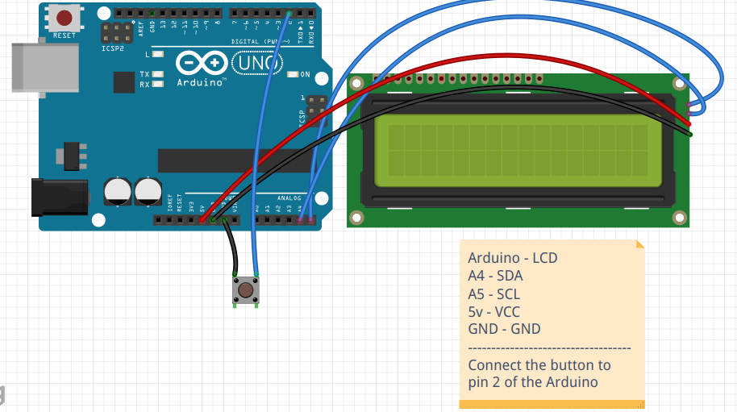

# Arduino_LCD_16x2_Endless_Runner_Game
16x2 game on an Arduino. This game is controlled by a single button which makes the runner jump.

# Components
1. Arduino uno
2. I2C LCD display
3. Push button
4. Jumper wires

# Circuit

